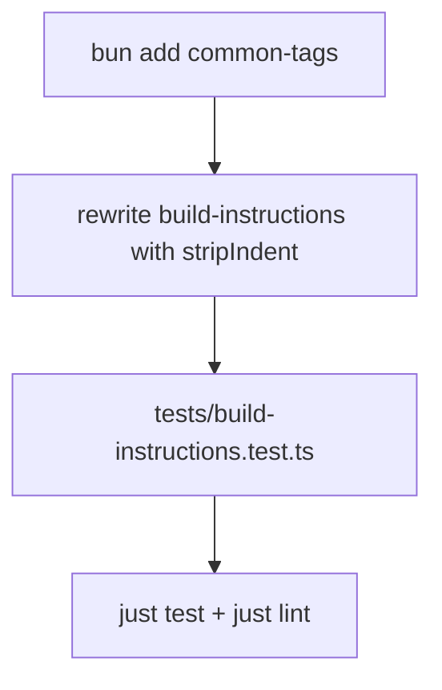

# Spec: Readable system prompts with common-tags

## Objective

Hoy el system prompt en [`agent/lib/build-instructions.ts`](agent/lib/build-instructions.ts) se arma con cascadas de `+= "...\n"`. Funciona, pero es difícil de leer y editar.

**Qué construimos:** la misma instrucción del agente (rol + pasos + rúbrica + bloque de submission / clientContext), escrita con **template literals + `stripIndent` de `common-tags`**, más un **unit test** que documente cómo se espera el prompt.

**Usuario:** el ingeniero que mantiene el prompt (y, indirectamente, el modelo que lo consume).

**Éxito:** el archivo se lee como prosa indentada en el código; el texto emitido conserva el contenido semántico; el test falla si se rompe orden o secciones clave.

## Assumptions (corrígeme si no)

1. `common-tags` es **dependency** de runtime; `@types/common-tags` es **devDependency**.
2. No cambiamos el copy del prompt (salvo whitespace normalizado por `stripIndent`).
3. Seguimos montando por secciones (`header` / `steps` / `rubric` / submission|hint) y el orden actual: **contexto primero**, luego rol/pasos/rúbrica.
4. El test **no** hace snapshot del string entero (frágil con whitespace); asserts por claves + orden.
5. Sin husky ni cambios de evals en este change.

## Tech Stack

- TypeScript + Bun
- `common-tags` → `stripIndent` (y solo eso; no hace falta `oneLine` / `html`)
- Vitest (suite existente en `tests/`)
- Ultracite/Biome ya en el repo (`just lint`)

## Commands

```bash
. "$HOME/.nvm/nvm.sh" && nvm use 24

bun add common-tags
bun add -d @types/common-tags

just test
just lint
just build   # smoke: no romper el agent bundle
```

## Project Structure

```
agent/lib/build-instructions.ts   → único módulo de prompt (refactor)
tests/build-instructions.test.ts  → unit test de construcción
package.json                      → deps common-tags
```

Sin tocar `agent/instructions/system.ts` (solo importa los builders).

## Code Style — cómo usaremos `common-tags`

### Qué hace `stripIndent`

El indent **común** de todas las líneas del template se elimina. Así puedes indentar el prompt dentro de la función sin meter 4–6 espacios en el string final.

```ts
import { stripIndent } from "common-tags";

// Código indentado en el archivo…
function header() {
  return stripIndent`
    You are Expense Guard, an automated expense-review agent for a multi-company expense
    platform. Each submission gives you a company_id, a receipt (raw OCR text), a claimed
    amount, and a category. Return exactly one decision: approve, flag_for_review, or reject.
  `;
}
// …emite líneas que empiezan en columna 0 (sin el indent del template).
```

### Antes → después (fragmento real de `steps`)

**Antes (hoy):**

```ts
function steps() {
  let x = "";
  x += "\n";
  x += "How to review a submission:\n";
  x +=
    "1. Call search_policy with the submission's company_id to retrieve that company's written\n";
  x +=
    "   expense policy. Never rely on policy you remember from another company — each company\n";
  x += "   sets its own limits.\n";
  // …
  return x;
}
```

**Después (objetivo):**

```ts
function steps() {
  return stripIndent`

    How to review a submission:
    1. Call search_policy with the submission's company_id to retrieve that company's written
       expense policy. Never rely on policy you remember from another company — each company
       sets its own limits.
    2. Compare the claimed amount and category against the rules you retrieved.
    3. Double-check that the receipt totals add up and that the receipt is legible before you
       decide. You may call validate_expense to sanity-check the submission's fields.
  `;
}
```

Nota: el indent relativo de las líneas continuadas (`expense policy…`) se **preserva** porque es mayor que el indent común; solo se quita el indent base del bloque.

### Interpolación (fecha + JSON)

```ts
function renderSubmission(submission: tExpenseSubmission, now: Date): string {
  const payload = {
    category: submission.category,
    claimed_amount: submission.claimed_amount,
    company_id: submission.company_id,
    currency: submission.currency ?? "USD",
    line_items: submission.line_items ?? [],
    receipt: submission.receipt,
  };

  return stripIndent`
    Current date: ${now.toISOString()}
    Submission under review:
    ${JSON.stringify(payload, null, 2)}
  `;
}
```

`JSON.stringify(..., null, 2)` ya trae sus propios saltos; al interpolarlo dentro de `stripIndent` queda embebido tal cual bajo `Submission under review:`.

### Ensamblaje final (mismo orden que hoy)

```ts
export function buildSystemPrompt(
  submission: tExpenseSubmission,
  now: Date
): string {
  return stripIndent`
    ${renderSubmission(submission, now)}

    ${header()}
    ${steps()}
    ${rubric()}
  `.trim();
}

export function buildClientContextSystemPrompt(now: Date): string {
  return stripIndent`
    ${clientContextHint(now)}

    ${header()}
    ${steps()}
    ${rubric()}
  `.trim();
}
```

- Condicionales al estilo del ejemplo del usuario (`${esAdmin ? "…" : ""}`) **no hacen falta hoy**; si aparecen ramas, el mismo patrón aplica.
- Evitar `void` / hacks de lint; si Biome se queja de templates multilínea, ajustar whitespace mínimo, no silenciar el preset.

### `rubric()` completo (mismo texto, forma legible)

```ts
function rubric() {
  return stripIndent`

    Decision rubric:
    - approve: the expense clearly falls within a policy rule and nothing looks off.
    - flag_for_review: the expense is over a limit that allows manager/approver sign-off, or
      something is ambiguous and a human should take a look.
    - reject: the expense violates a hard rule (for example a non-reimbursable category).

    When a policy limit depends on a fact (for example number of attendees,
    nights, units, or duration):
    - Use the fact only if it is explicitly stated on the receipt or submission.
    - If you would have to infer that fact from line labels, quantities, or wording,
      treat the case as ambiguous and choose flag_for_review.
    - Do not approve based on an inference that makes the claim fit under the limit.

    Always put the specific policy rule that drives your decision — its id and limit — in
    cited_rule. In your reason, quote the specific receipt details that justify the decision
    so a reviewer can see the evidence you used.
  `;
}
```

## Testing Strategy

Archivo nuevo: [`tests/build-instructions.test.ts`](tests/build-instructions.test.ts).

- Framework: Vitest (`just test`).
- Date fija: `new Date("2026-01-15T12:00:00.000Z")`.
- Submission mínima en memoria (no fixture file):

```ts
const submission = {
  company_id: "acme",
  category: "meals",
  claimed_amount: 42,
  currency: "USD",
  receipt: "Lunch at Cafe",
  line_items: [{ label: "Lunch", amount: 42 }],
};
```

**Ejemplo de asserts (estructura, no snapshot total):**

```ts
it("buildSystemPrompt puts submission before role and includes rubric", () => {
  const prompt = buildSystemPrompt(submission, FIXED_NOW);

  expect(prompt).toContain("Current date: 2026-01-15T12:00:00.000Z");
  expect(prompt).toContain('"company_id": "acme"');
  expect(prompt).toContain('"claimed_amount": 42');

  expect(prompt).toContain("You are Expense Guard");
  expect(prompt).toContain("How to review a submission:");
  expect(prompt).toContain("Decision rubric:");
  expect(prompt).toContain("infer that fact");
  expect(prompt).toContain("flag_for_review");

  const dateAt = prompt.indexOf("Current date:");
  const roleAt = prompt.indexOf("You are Expense Guard");
  expect(dateAt).toBeGreaterThanOrEqual(0);
  expect(roleAt).toBeGreaterThan(dateAt);
});

it("buildClientContextSystemPrompt points at expense_submission", () => {
  const prompt = buildClientContextSystemPrompt(FIXED_NOW);
  expect(prompt).toContain("expense_submission");
  expect(prompt).toContain("You are Expense Guard");
  expect(prompt).not.toContain("Lunch at Cafe"); // no inventa el receipt del otro path
});
```

Niveles: solo unit del builder. No nuevos evals Eve por este change.

## Boundaries

- **Always:** mismo orden de secciones; `just test` + `just lint` verdes; deps tipadas.
- **Ask first:** cambiar el copy del prompt; desactivar reglas Ultracite; añadir husky.
- **Never:** hardcodear ejemplos de fixtures (`Burgers x2`) en el prompt; snapshot frágil del prompt completo; tocar `system.ts` salvo imports rotos.

## Success Criteria

- [ ] `build-instructions.ts` usa `stripIndent` + templates (sin cascada `+= "...\\n"`).
- [ ] Contenido semántico equivalente (rol, pasos, rúbrica, no-inferencia, submission/hint).
- [ ] `tests/build-instructions.test.ts` documenta forma esperada (fecha, JSON keys, orden, clientContext).
- [ ] `just test` y `just lint` OK.

## Open Questions

Ninguna bloqueante.

---

## Plan técnico



Orden: deps → refactor → test → verify.

Riesgo: whitespace distinto al string histórico. Mitigación: asserts por contenido/orden, no igualdad exacta del prompt completo; `.trim()` en el ensamblaje final si hace falta.

## Tasks

- [ ] **Task: deps** — `bun add common-tags` + `@types/common-tags`
  - Acceptance: import resuelve en TS
  - Verify: `bun pm ls common-tags`
  - Files: `package.json`, `bun.lock`

- [ ] **Task: refactor** — reescribir helpers + builders con `stripIndent`
  - Acceptance: sin concatenaciones `+=` de líneas de prompt
  - Verify: lectura visual + `just lint`
  - Files: `agent/lib/build-instructions.ts`

- [ ] **Task: unit test** — asserts de fecha, JSON, secciones, orden, clientContext
  - Acceptance: test rojo si se quita la rúbrica o se invierte el orden
  - Verify: `just test`
  - Files: `tests/build-instructions.test.ts`

- [ ] **Task: verify** — `just test` + `just lint` (+ `just build` smoke)
