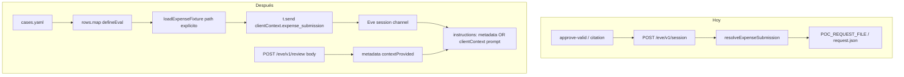

# Spec: Per-fixture evals without POC_REQUEST_FILE

## Objective

Hoy `resolveExpenseSubmission` cae a `POC_REQUEST_FILE` / `fixtures/request.json` cuando el channel Eve (evals) no trae metadata. Todos los evals revisan el mismo gasto; con concurrency eso además es frágil.

Queremos el patrón Eve dataset ([`docs/evals/cases.mdx`](node_modules/eve/docs/evals/cases.mdx)): **un eval por fixture**, cargando el JSON de forma explícita, sin default silencioso.

## Assumptions

1. Evals siguen yendo por **Eve session** (`/eve/v1/session`), no por `/eve/v1/review`.
2. Cada caso pasa la submission en `t.send({ clientContext: { expense_submission } })` (API documentada en messages).
3. Channel **review** sigue inyectando via `state` → `metadata` (HTTP one-shot).
4. Sin metadata y sin clientContext usable en instructions: **no** hay fallback a fixture — fallo ruidoso.
5. `request.json` ≡ `valid.json` → el dataset usa `valid` una sola vez (no duplicar).
6. Expectativas iniciales del dataset:

| Fixture | expect_decision |
|---------|-----------------|
| `fixtures/valid.json` | `approve` |
| `fixtures/ambiguous.json` | `flag_for_review` |
| `fixtures/illegible.json` | `flag_for_review` |
| `fixtures/cross-company.json` | `approve` (Initech meal in-policy) |

7. Body vacío en review: **400** (ya no fixture silencioso), alineado con “siempre explícito”. `just review fixtures/...` no cambia.

## Tech Stack

Eve evals (`defineEval`, `loadYaml` / `loadJson` from `eve/evals/loaders`), Zod `ExpenseSubmissionSchema`, channel metadata + `clientContext`.

## Commands

```bash
. "$HOME/.nvm/nvm.sh" && nvm use 24
just build
just evals                 # fan-out por fixture
just test                  # Vitest (sin regresión body 400)
just review fixtures/valid.json
```

## Project Structure

```
evals/data/cases.yaml          → dataset (fixture path + expect_decision + description)
evals/decision.eval.ts         → fan-out defineEval[] (reemplaza approve-valid)
evals/policy-citation.eval.ts  → fan-out sobre los mismos cases (judge)
evals/shared.ts                → load case + parse submission helper
agent/lib/request-context.ts   → loadExpenseFixture(path) requerido; resolve sin fallback
agent/lib/build-instructions.ts / instructions/system.ts → metadata vs clientContext path
agent/channels/review.ts       → body vacío → 400 (no fixture)
.env.example / Notes.md        → quitar POC_REQUEST_FILE default
FINDINGS.md                    → finding #3 corto
```

## Code Style

Dataset:

```yaml
# evals/data/cases.yaml
evals:
  - id: valid
    fixture: fixtures/valid.json
    description: Within-policy Acme meal is approved
    expect_decision: approve
  - id: ambiguous
    fixture: fixtures/ambiguous.json
    description: Over-limit Acme software is flagged
    expect_decision: flag_for_review
  # ...
```

Eval fan-out:

```ts
import { defineEval } from "eve/evals";
import { loadYaml } from "eve/evals/loaders";
import { matches } from "eve/evals/expect";
import { loadCaseSubmission, type EvalCase } from "./shared.js";

const doc = await loadYaml("evals/data/cases.yaml");
const rows = doc.evals as EvalCase[];

export default rows.map((row) =>
  defineEval({
    description: row.description,
    tags: ["expense-guard", "decision", row.id],
    async test(t) {
      const submission = await loadCaseSubmission(row.fixture);
      const Expected = ExpenseDecisionSchema.refine(
        (d) => d.decision === row.expect_decision,
        `expected ${row.expect_decision}`,
      );
      const turn = await t.send({
        message: "Review the expense submission and return your decision.",
        clientContext: { expense_submission: submission },
        outputSchema: ExpenseDecisionSchema,
      });
      t.didNotFail();
      t.calledTool("search_policy").gate();
      t.check(turn.data, matches(Expected)).gate();
    },
  }),
);
```

Resolver (sin POC default):

```ts
export function loadExpenseFixture(path: string): tExpenseSubmission {
  const raw = JSON.parse(readFileSync(path, "utf8"));
  return ExpenseSubmissionSchema.parse(raw);
}

export function resolveExpenseSubmission(view): tExpenseSubmission {
  if (view?.contextProvided === true && isPlainObject(view.request)) {
    return ExpenseSubmissionSchema.parse(view.request);
  }
  throw new Error(
    "No expense submission in channel metadata. " +
      "HTTP review must send a validated body; evals must pass clientContext.expense_submission.",
  );
}
```

Instructions: si `resolve` OK (review) → embed submission en system prompt como hoy. Si falla por falta de metadata (path Eve/eval) → system prompt **sin** embed de fixture + instrucción de usar `clientContext.expense_submission`; `submissionState` se actualiza parseando ese objeto desde… 

**Detalle de diseño fijado:** en el path eval, `buildSystemPrompt` recibe la submission **solo** cuando viene de metadata. Para evals, además de `clientContext`, el helper del eval **no** puede setear metadata del channel Eve.

Por eso el prompt genérico del path Eve dice explícitamente que la submission está en client context, y `submissionState` queda `null` en ese path (hoy las tools no leen `submissionState`; solo lo setea instructions). El modelo razona con el JSON de `clientContext`.

## Testing Strategy

| Nivel | Qué |
|-------|-----|
| `just evals` | N casos decision + N citation; cada uno con su fixture vía clientContext |
| `just test` | Schema + HTTP 400 sin regresión |
| Manual | `just review fixtures/ambiguous.json` sigue 200 |

No Vitest para el fan-out (son agent evals).

## Boundaries

- **Always:** fixture path explícito en dataset; FINDINGS #3 corto; Zod-parse al cargar fixture.
- **Ask first:** cambiar expectativas de decisión; reintroducir `POC_REQUEST_FILE`.
- **Never:** `process.env.POC_REQUEST_FILE` como fuente implícita en `resolveExpenseSubmission`; un solo fixture compartido para todos los evals.

## Success Criteria

- [ ] `resolveExpenseSubmission` no lee `POC_REQUEST_FILE`.
- [ ] `evals/data/cases.yaml` lista los 4 fixtures con `expect_decision`.
- [ ] `eve eval` crea un caso por fila (ids tipo `decision/0000`…).
- [ ] Cada `t.send` incluye `clientContext.expense_submission` cargado de su fixture.
- [ ] Sin `POC_REQUEST_FILE` en `.env.example` como default de eval.
- [ ] FINDINGS #3 breve.

## Open Questions

Ninguna bloqueante; expectativas de la tabla arriba fijadas (ajustables luego si un eval falla por juicio de policy).

---

## Plan técnico



Orden: request-context (quitar fallback) → instructions/prompt path Eve → review empty-body 400 → cases.yaml + shared + decision/citation fan-out → docs/FINDINGS → `just evals`.

Riesgo: el modelo ignora clientContext y alucina — mitigado con system prompt que apunta al campo `expense_submission` y gate `expect_decision`.

---

## Tasks

1. **Kill silent fixture** — `loadExpenseFixture(path)`, `resolveExpenseSubmission` throws sin metadata; limpiar `.env.example`.
2. **Instructions path** — metadata → embed; sin metadata → prompt eval/clientContext (sin POC).
3. **Review empty body** — 400 si body vacío/no-objeto.
4. **Dataset** — `evals/data/cases.yaml` + `evals/shared.ts`.
5. **Evals** — `decision.eval.ts` fan-out; adaptar `policy-citation.eval.ts`; quitar/reemplazar `approve-valid.eval.ts`.
6. **FINDINGS #3** + verificar `just evals` / `just test`.
