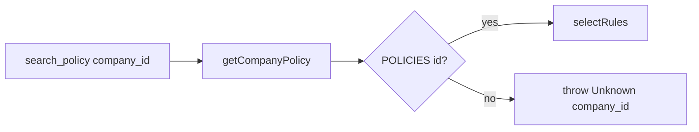

# Spec: Fix policy-store tenant isolation

## Objective

`getCompanyPolicy` tiene dos bugs de aislamiento:

1. **Memo global** `activePolicy` — la primera empresa gana para todo el proceso.
2. **Fallback a Acme** — `POLICIES[companyId] ?? POLICIES.acme` aplica reglas ajenas si el id no existe.

Fix: lookup directo por `companyId`; desconocido → throw. Sin cache de proceso (el mapa `POLICIES` ya es O(1)).

## Assumptions

1. Solo tocamos [`agent/lib/policy-store.ts`](agent/lib/policy-store.ts) (+ tests/FINDINGS). No forzamos aún `company_id` desde `submissionState` en el tool (fuera de scope).
2. Unknown id → `throw new Error(...)` (la tool falla ruidoso; no devolver policy inventada).
3. Tras el fix, [`tests/policy-store.test.ts`](tests/policy-store.test.ts) y [`evals/tenant-isolation.eval.ts`](evals/tenant-isolation.eval.ts) deben **pasar**.
4. Añadir unit test de unknown company.

## Tech Stack

Sin deps nuevas. Vitest + eve eval existentes.

## Commands

```bash
. "$HOME/.nvm/nvm.sh" && nvm use 24
just test
bunx eve eval tenant-isolation
```

## Project Structure

```
agent/lib/policy-store.ts      → quitar memo + fallback Acme
tests/policy-store.test.ts     → isolation + unknown company
FINDINGS.md                    → #4 Fixed
```

## Code Style

```ts
export function getCompanyPolicy(companyId: string): tCompanyPolicy {
  const resolved = POLICIES[companyId];
  if (!resolved) {
    throw new Error(`Unknown company_id "${companyId}". No expense policy is configured.`);
  }
  return resolved;
}
```

Sin `activePolicy`. `searchPolicy` / `selectRules` / `formatRules` sin cambios de firma.

## Testing Strategy

| Test | Antes | Después |
|------|-------|---------|
| Vitest successive acme→globex | fail | pass |
| Vitest `searchPolicy("nope")` throws | n/a | pass |
| `eve eval tenant-isolation` | fail | pass |

## Boundaries

- **Always:** tests verdes de aislamiento; FINDINGS #4 actualizado.
- **Ask first:** cache por-companyId; forzar company_id desde submissionState en la tool.
- **Never:** fallback silencioso a otra empresa; dejar el eval fallando “on purpose” tras el fix.

## Success Criteria

- [ ] No existe `activePolicy` / `?? POLICIES.acme`.
- [ ] Unknown `company_id` lanza error.
- [ ] `just test` incluye policy-store en verde.
- [ ] `eve eval tenant-isolation` pasa.
- [ ] FINDINGS #4 marca Fixed.

---

## Plan técnico



Orden: fix `getCompanyPolicy` → ampliar Vitest → FINDINGS → `just test` + `eve eval tenant-isolation`.

---

## Tasks

1. **Fix store** — Reescribir `getCompanyPolicy` sin memo ni fallback Acme.
2. **Tests** — Actualizar comentarios del isolation test; añadir caso unknown throws.
3. **FINDINGS #4** — documentar Fixed.
4. **Verify** — `just test` + `bunx eve eval tenant-isolation`.
