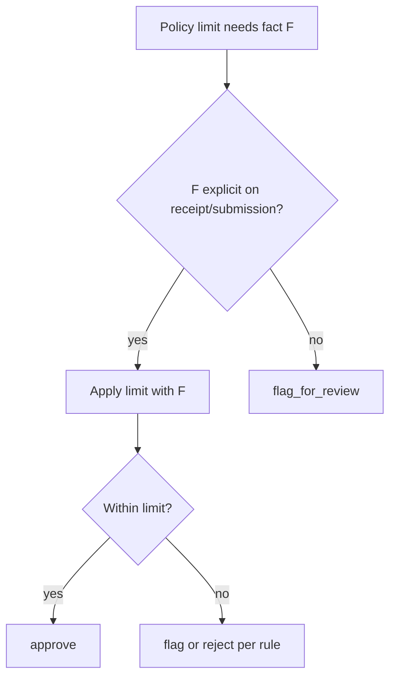

# Spec: Generic ambiguity rule in prompt

## Objective

Estabilizar `decision/0003` (cross-company) haciendo que el agente **flagee** cuando un límite de política depende de un hecho que habría que **inferir**, sin hardcodear el ejemplo del fixture (`Burgers x2`).

## Assumptions

1. `expect_decision` de cross-company se queda en `flag_for_review` ([evals/data/cases.yaml](evals/data/cases.yaml)).
2. La regla vive en `rubric()` de [agent/lib/build-instructions.ts](agent/lib/build-instructions.ts) (aplica a HTTP review y a evals vía `buildClientContextSystemPrompt`).
3. Redacción **genérica**: categorías de hechos (attendees, nights, quantity, duration), no líneas literales del recibo.
4. Lectura conservadora: si el hecho no está explícito, no asumir el valor que haría pasar el límite.
5. Actualizar la `description` de cross-company para que coincida con el expect (hoy dice “approved”).

## Tech Stack

Prompt-only (TypeScript string en `build-instructions.ts`). Sin cambios de tools/schema.

## Commands

```bash
. "$HOME/.nvm/nvm.sh" && nvm use 24
just evals
```

## Project Structure

```
agent/lib/build-instructions.ts   → ampliar rubric()
evals/data/cases.yaml             → description cross-company
```

## Code Style

Añadir tras el bullet de `flag_for_review` / antes del cierre de cited_rule, texto en el estilo actual (líneas cortas concatenadas):

```ts
r += "\n";
r += "When a policy limit depends on a fact (for example number of attendees,\n";
r += "nights, units, or duration):\n";
r += "- Use the fact only if it is explicitly stated on the receipt or submission.\n";
r += "- If you would have to infer that fact from line labels, quantities, or wording,\n";
r += "  treat the case as ambiguous and choose flag_for_review.\n";
r += "- Do not approve based on an inference that makes the claim fit under the limit.\n";
```

Sin ejemplos de comida/recibos concretos.

En `cases.yaml`:

```yaml
description: Initech meal over per-attendee limit with inferred headcount is flagged
```

## Testing Strategy

- `just evals` — `decision/0003` debe pasar `matches` con `flag_for_review`.
- Confirmar que `decision/0000`–`0002` y citations / tenant-isolation no se rompen (la regla no debería afectar límites explícitos ni illegible/software over-limit).

## Boundaries

- **Always:** regla genérica; description alineada con expect.
- **Ask first:** cambiar fixture o política Initech.
- **Never:** mencionar `Burgers x2`, DINER 88, ni montos del fixture en el prompt.

## Success Criteria

- [ ] Rubric incluye regla de no-inferencia sin overfitting al fixture.
- [ ] Description cross-company coherente con `flag_for_review`.
- [ ] `just evals`: `decision/0003` gates 3/3 (y el resto no regresa).

---

## Plan técnico



Orden: editar `rubric()` → alinear `cases.yaml` → `just evals`.

## Tasks

1. **Prompt** — añadir bloque genérico de ambigüedad en `rubric()`.
2. **Dataset** — corregir description de cross-company.
3. **Verify** — `just evals`.
