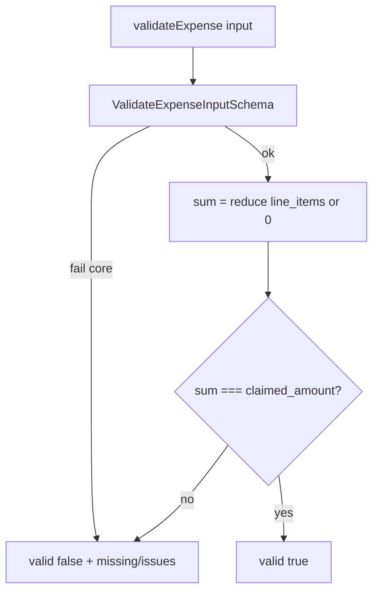

# Spec: Harden validate_expense with Zod

## Objective

[`validateExpense`](agent/tools/validate_expense.ts) solo comprueba presencia de `company_id` / `category` / `claimed_amount` y **ignora** `line_items`. Fixtures como `illegible.json` (claimed 1280 vs line 45) pasan como `valid: true`.

Los tests en [`tests/validate-expense.test.ts`](tests/validate-expense.test.ts) ya fallan en rojo. El fix usa Zod + check de suma para ponerlos en verde.

## Assumptions

1. Si `line_items` viene **no vacío**, `sum(amounts)` debe igualar `claimed_amount` (igualdad exacta; montos enteros en fixtures).
2. Si `line_items` está **ausente o `[]`**, el total implícito es 0 → `claimed_amount` **debe ser `0`**. Un claimed > 0 sin líneas es inválido (no hay early-return que lo ignore).
3. Reutilizar [`ExpenseLineItemSchema`](agent/lib/expense.schema.ts); no duplicar shapes a mano.
4. El `inputSchema` de la tool incluye `line_items` opcional para que el modelo pueda pasarlos.
5. No cableamos aún `submissionState` en esta tool (ask first / follow-up).
6. FINDINGS #5 documenta el bug + fix.
7. Ampliar el unit test con casos: sin `line_items` + `claimed_amount: 0` → valid; sin líneas + claimed > 0 → invalid.

## Tech Stack

Zod 4 (ya en repo), Vitest.

## Commands

```bash
. "$HOME/.nvm/nvm.sh" && nvm use 24
bunx vitest run tests/validate-expense.test.ts
just test
```

## Project Structure

```
agent/tools/validate_expense.ts     → Zod schema + sum check; limpiar doIt manual
tests/validate-expense.test.ts      → ya escrito (rojo → verde)
FINDINGS.md                         → #5
```

## Code Style

```ts
const ValidateExpenseInputSchema = z.object({
  company_id: z.string().min(1),
  category: z.string().min(1),
  claimed_amount: z.number().finite(),
  line_items: z.array(ExpenseLineItemSchema).optional(),
}).superRefine((data, ctx) => {
  const items = data.line_items ?? [];
  const sum = items.reduce((s, i) => s + i.amount, 0);
  // Empty / missing line_items ⇒ expected total is 0
  if (sum !== data.claimed_amount) {
    ctx.addIssue({
      code: "custom",
      message: `claimed_amount (${data.claimed_amount}) does not match line_items sum (${sum})`,
      path: ["claimed_amount"],
    });
  }
});
```

Una sola regla: **claimed_amount === sum(line_items)** (suma 0 si no hay ítems).

## Testing Strategy

Tests existentes:

- `valid.json` → `valid: true`
- `illegible.json` mismatch → `valid: false` + issue matching sum/total
- mismatch explícito 100 vs 50 → `valid: false`

Añadir:

- sin `line_items` (o `[]`) + `claimed_amount: 0` → `valid: true`
- sin `line_items` (o `[]`) + `claimed_amount: 100` → `valid: false` (suma implícita 0)

## Boundaries

- **Always:** tests validate-expense verdes; Zod en lugar de ifs manuales; FINDINGS #5.
- **Ask first:** leer `submissionState` en la tool.
- **Never:** dejar el check de suma solo en el prompt del modelo.

## Success Criteria

- [ ] `validateExpense` usa Zod + `superRefine` (o equivalente) para la suma.
- [ ] `bunx vitest run tests/validate-expense.test.ts` → all pass.
- [ ] Tool `inputSchema` acepta `line_items` opcional.
- [ ] FINDINGS #5 breve.

---

## Plan técnico



Orden: implementar Zod en tool → ampliar tests empty/zero → verde → FINDINGS → `just test`.

---

## Tasks

1. **Rewrite validateExpense** — Zod + regla única `claimed === sum(items|[])`; actualizar tool inputSchema/execute.
2. **Tests** — añadir empty line_items + claimed 0 / claimed > 0; confirmar suite verde.
3. **FINDINGS #5** — corto, estilo existente.
