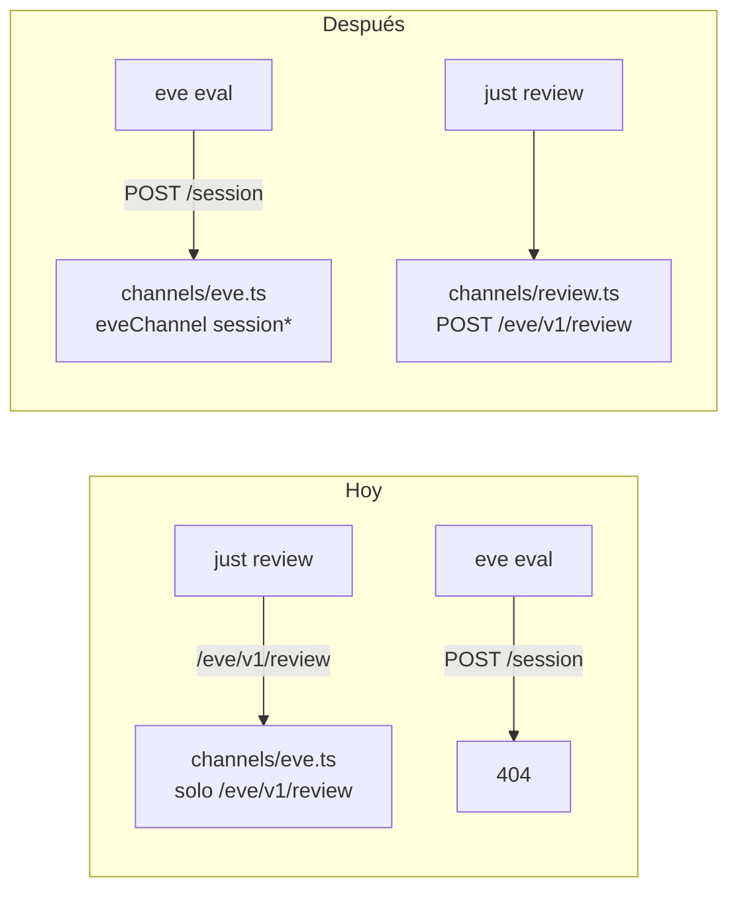

# Spec: Restore default Eve channel + review channel

## Objective

Los evals fallan con 404 en `POST /eve/v1/session` porque [`agent/channels/eve.ts`](agent/channels/eve.ts) **reemplaza** el channel HTTP default de Eve (documentado en `eve/docs/channels/eve.mdx`) con un `defineChannel` que solo monta `POST /eve/v1/review`.

Queremos:
- Channel **eve** clásico: rutas de sesión (`/eve/v1/session*`) para evals, TUI y SDK.
- Channel **review**: el endpoint one-shot actual, sin pisar el default.

**Usuario:** quien corre `just evals` / `bunx eve eval`, y quien hace `just review` vía curl.

## Assumptions (corrígeme si no)

1. El fix es solo el split de channels; **no** incluye aún los bugs de tenant/coste/validate del challenge.
2. Se conserva la ruta `POST /eve/v1/review` (no cambia el justfile).
3. Evals siguen usando el fixture (`POC_REQUEST_FILE` / `fixtures/request.json`) vía `resolveExpenseSubmission` cuando el channel Eve no setea `contextProvided` — **no hace falta** cablear el body del eval al review channel.
4. Restaurar Eve con `eveChannel()` explícito (auth default) es preferible a borrar `eve.ts`.

## Tech Stack

Sin cambios: Eve 0.11, TypeScript, Bun, Zod. APIs: `eveChannel` from `eve/channels/eve`, `defineChannel` from `eve/channels`.

## Commands

```bash
just install
just build
just evals          # success criteria: ya no 404 en /eve/v1/session
just dev            # en otra terminal
just review fixtures/ambiguous.json
```

## Project Structure (post-change)

```
agent/channels/
  eve.ts      → eveChannel(...)  # default session API
  review.ts   → defineChannel + POST /eve/v1/review  # moved from current eve.ts
```

## Code Style

Seguir el patrón Eve docs:

```ts
// agent/channels/eve.ts
import { eveChannel } from "eve/channels/eve";
import { localDev, vercelOidc } from "eve/channels/auth";

export default eveChannel({
  auth: [localDev(), vercelOidc()],
});
```

`review.ts` = contenido actual de `eve.ts` con comentarios actualizados (channel id = stem `review`).

## Testing Strategy

1. **Harness:** `just evals` — deja de fallar por ruta faltante. Pueden seguir fallando por calidad del agente; el éxito de *este* change es: no 404 `/eve/v1/session`.
2. **Manual:** con `just dev`, `just review fixtures/valid.json` responde `{ ok: true, data: ... }` (o error de modelo, no 404 de ruta).
3. No nuevos evals en este change.

## Boundaries

- **Always:** build antes de evals; conservar `buildRequestView` / `drainDecision` en review; actualizar Notes si menciona solo `channels/eve.ts`.
- **Ask first:** cambiar path HTTP del review; tocar modelo/tools/policies; ampliar FINDINGS.md con otros bugs.
- **Never:** borrar el endpoint review; hardcodear secrets; “arreglar” evals saltándolos.

## Success Criteria

- [ ] Existe [`agent/channels/review.ts`](agent/channels/review.ts) con el channel one-shot.
- [ ] [`agent/channels/eve.ts`](agent/channels/eve.ts) exporta `eveChannel(...)` (rutas session).
- [ ] `just evals` ya **no** reporta `Cannot find any route matching [POST] .../eve/v1/session`.
- [ ] `just review` sigue pegándole a `/eve/v1/review`.

---

## Plan técnico



Orden:
1. Extraer el channel custom a `review.ts` (mismo código).
2. Reemplazar `eve.ts` con `eveChannel` default.
3. Verificar con `just build` + `just evals` (sin 404 de session).
4. Smoke `just review` si hay `just dev` / gateway.

Riesgo bajo: si `eveChannel` import path difiere en 0.11.7, ajustar según exports del paquete (`eve/channels/eve`).

---

## Tasks

1. **Mover review channel** — Copiar lógica de [`agent/channels/eve.ts`](agent/channels/eve.ts) a `agent/channels/review.ts`; actualizar header comment. Acceptance: archivo exporta `defineChannel` con `POST /eve/v1/review`. Verify: `just build`.
2. **Restaurar eve channel** — Reescribir [`agent/channels/eve.ts`](agent/channels/eve.ts) con `eveChannel({ auth: [localDev(), vercelOidc()] })`. Acceptance: monta `/eve/v1/session*`. Verify: `just evals` sin 404 de session.
3. **Docs menores** — Actualizar [`Notes.md`](Notes.md) (path del channel review). Acceptance: diagrama/lista apuntan a `channels/review.ts` + eve default.
