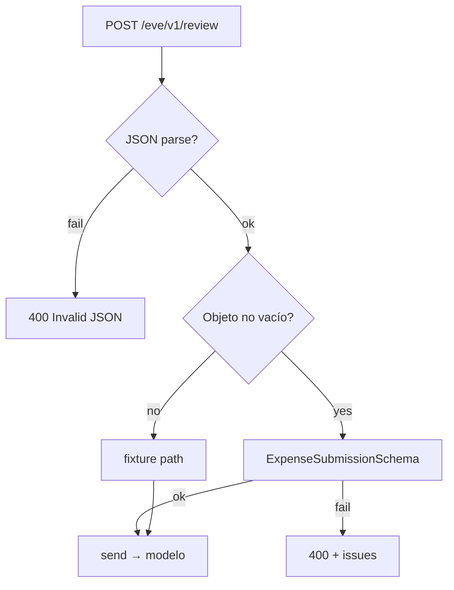

# Spec: Validate review request body

## Objective

`POST /eve/v1/review` hoy acepta cualquier objeto no vacío y llama al modelo. Validar con Zod **antes** de `send()` → incompleto = **400** sin tokens. Cubrir con tests **determinísticos** (Vitest), no con `eve eval` (esos quedan para comportamiento del agent).

## Assumptions

1. Campos **requeridos**: `company_id`, `category`, `claimed_amount`, `receipt`.
2. Opcionales: `currency`, `line_items`, `workspace_id`, `chat_id`, `label`.
3. Body vacío / no-objeto → fixture path (sin cambio).
4. Solo channel `review`.
5. Error: `{ ok: false, error, issues? }` status **400**.
6. Tests HTTP con **Vitest + Supertest** contra un server ya corriendo (`EVE_HOST`, default `http://127.0.0.1:2000`). No hace falta Express: `request(url)` acepta URL string.
7. **No** agregar al justfile el curl de body inválido; sí agregar `just test` para Vitest.
8. **No** usar `fetch` nativo en los tests — solo Supertest.

## Respuesta: ¿supertest sin Express?

Sí. Supertest acepta una **URL string**:

```ts
import request from "supertest";

const api = request(process.env.EVE_HOST ?? "http://127.0.0.1:2000");

const res = await api
  .post("/eve/v1/review")
  .send({ company_id: "acme", label: "production" });

expect(res.status).toBe(400);
```

**Elegimos Vitest + Supertest** (devDeps: `vitest`, `supertest`, `@types/supertest`). Los tests HTTP del **400** no llaman al modelo. Path 200 (modelo) fuera de scope.

## Tech Stack

Zod 4, Eve, Vitest + Supertest (devDependencies nuevas).

## Commands

```bash
. "$HOME/.nvm/nvm.sh" && nvm use 24
just build
just test                       # Vitest (schema siempre; HTTP si server up)
just dev                        # otra terminal, para tests HTTP / smoke
just review fixtures/valid.json # path feliz manual
```

## Project Structure

```
agent/lib/expense.schema.ts     → + ExpenseSubmissionSchema
agent/lib/request-context.ts    → tipos del schema
agent/channels/review.ts        → safeParse antes de send()
tests/expense-submission.test.ts → unit schema (sin server)
tests/review-http.test.ts        → Supertest POST inválido → 400 (EVE_HOST)
vitest.config.ts
package.json                    → vitest, supertest, @types/supertest; "test": "vitest run"
justfile                        → recipe test (no curl inválido)
FINDINGS.md                     → finding #2 corto
```

## Code Style

Schema + gate en review (igual que antes). Test HTTP con Supertest:

```ts
import { describe, it, expect } from "vitest";
import request from "supertest";

const api = request(process.env.EVE_HOST ?? "http://127.0.0.1:2000");

describe("POST /eve/v1/review", () => {
  it("rejects incomplete submission without calling the model", async () => {
    const res = await api
      .post("/eve/v1/review")
      .send({ company_id: "acme", label: "production" });

    expect(res.status).toBe(400);
    expect(res.body.ok).toBe(false);
    expect(res.body.issues).toBeTruthy();
  });
});
```

Si el server no responde, el suite HTTP hace `skip` o falla con mensaje claro (“start just dev”).

## Testing Strategy

| Nivel | Qué | Server | Modelo |
|-------|-----|--------|--------|
| Unit Vitest | `ExpenseSubmissionSchema` accept/reject | No | No |
| HTTP Vitest+Supertest | incompleto → 400 | Sí (`just dev`) | No |
| eve eval | agent behavior | harness | Sí — **fuera de este change** |

## Boundaries

- **Always:** validar antes de `send()`; `just test` verde en unit; FINDINGS corto.
- **Ask first:** exigir `line_items`; tests del path 200/modelo.
- **Never:** usar `eve eval` como prueba de esta validación; recipe justfile del curl inválido; llamar al modelo en body inválido; usar `fetch` en los tests (solo Supertest).

## Success Criteria

- Body incompleto → **400** + `issues`, sin tokens.
- `just test` pasa unit schema sin server.
- Con `just dev` up, test HTTP 400 pasa.
- `FINDINGS.md` finding #2 breve.
- Justfile sin recipe de curl inválido; sí `just test`.

---

## Plan técnico



Orden: schema → request-context → gate review → vitest setup + tests → just test → FINDINGS.

---

## Tasks

1. **Schema** — `ExpenseSubmissionSchema` en [`agent/lib/expense.schema.ts`](agent/lib/expense.schema.ts).
2. **Context** — alinear tipos en [`agent/lib/request-context.ts`](agent/lib/request-context.ts).
3. **Gate** — validación en [`agent/channels/review.ts`](agent/channels/review.ts).
4. **Vitest + Supertest** — deps (`vitest`, `supertest`, `@types/supertest`), config, unit schema + HTTP 400; `just test`.
5. **FINDINGS** — finding #2 corto.
