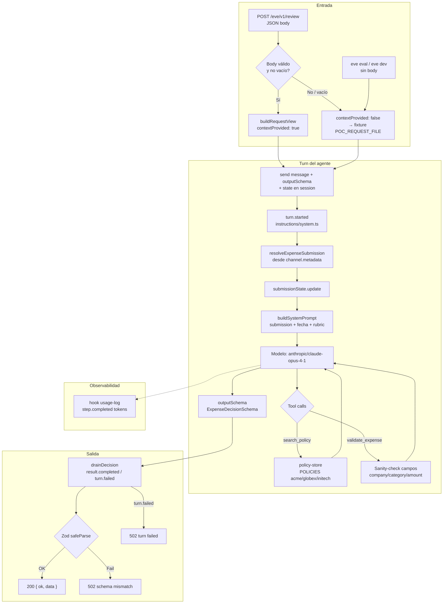
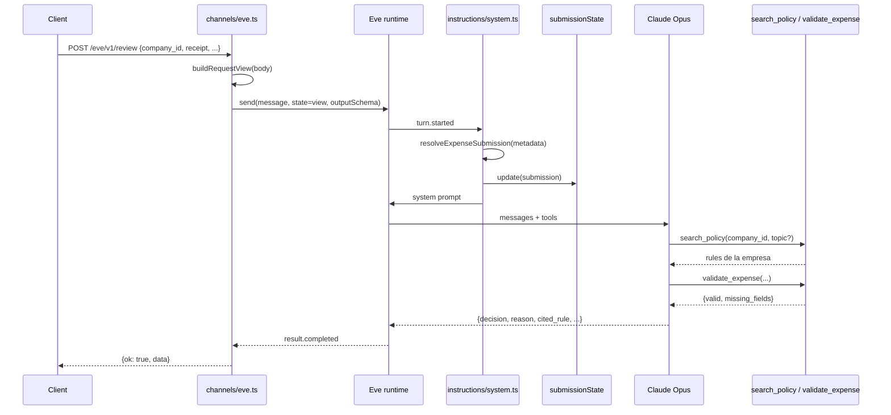

# Project scan and flow diagram
_Exported on 7/28/2026 at 09:33:03 GMT-4 from Cursor (3.13.21)_

---

**User**

Hola haz un scan rapido del todo el proyecto y explicame los detalles detallo en Notes.ms y quiero un diagrama en mermaid que explique el flujo

---

**Cursor**

Voy a hacer un scan rápido del proyecto y luego te explico el flujo con un diagrama Mermaid. En Ask mode no puedo crear `Notes.md`; te dejo el contenido listo para pegar.

Scan completo. Esto es un **challenge de AI Engineer**: un agente de revisión de gastos con bugs intencionales. En Ask mode no puedo crear `Notes.md`; aquí va el contenido listo para pegar.

---

## Qué es

**Expense Guard** — agente TypeScript sobre [Eve](https://github.com/vercel/eve) (Vercel) que revisa un gasto por empresa (`company_id` + recibo OCR + monto + categoría) contra la política de esa empresa y emite: `approve` | `flag_for_review` | `reject`.

Stack: Bun, Eve 0.11, Zod 4, AI Gateway → Anthropic.

---

## Estructura

```
expense-guard-challenge/
├── agent/
│   ├── agent.ts              # defineAgent + modelo + outputSchema
│   ├── sandbox.ts            # justbash (workaround macOS)
│   ├── channels/eve.ts       # POST /eve/v1/review
│   ├── instructions/system.ts
│   ├── hooks/usage-log.ts
│   ├── lib/                  # schema, policies, context, prompt
│   └── tools/                # search_policy + validate_expense (+ disables)
├── fixtures/                 # request, valid, ambiguous, cross-company, illegible
├── evals/                    # 2 evals happy-path
├── README.md, package.json, .env.example
```

---

## Flujo end-to-end

1. `POST /eve/v1/review` con JSON del gasto (o fixture si el body está vacío).
2. Channel: `buildRequestView` → `send()` con `state` + `outputSchema`.
3. En `turn.started`: resuelve submission → `submissionState` → system prompt.
4. Modelo (Opus) llama tools → emite decisión estructurada.
5. Channel drena el stream → valida con Zod → `{ ok: true, data }`.

---

## Diagrama Mermaid



Flujo de datos del contexto por request:



---

## Piezas clave

| Pieza | Rol |
|--------|-----|
| `agent.ts` | Modelo fijo Opus + `ExpenseDecisionSchema` |
| `channels/eve.ts` | HTTP, state→metadata, drain stream, validación final |
| `request-context.ts` | Fixture vs body; `submissionState` para tools |
| `build-instructions.ts` | Prompt: submission primero, luego rol/pasos/rúbrica |
| `policies.ts` | 3 tenants: acme, globex, initech |
| `policy-store.ts` | Lookup + filtro por topic; memo `activePolicy` |
| Tools deshabilitados | bash, grep, glob, read/write, web_*, todo, ask_question |

**Decision schema:** `decision`, `reason`, `cited_rule`, `category`, `claimed_amount`.

**Políticas (ejemplos):** Acme meals ≤$50/persona; alcohol → reject; Globex software siempre flag; Initech >$100 → flag.

**Fixtures:** `valid`/`request` (Acme meals $96 → approve); `ambiguous` (SaaS $450 → flag); `cross-company` (Initech); `illegible` (recibo ilegible → flag).

**Evals:** approve + citation (judge Haiku); ambos sobre el fixture default.

---

## Señales de problemas (el challenge)

Cosas que el README implica y el código sugiere:

1. **Costo** — Opus 4.1 para un review rutinario; prompt con fecha/submission al inicio (malo para cache).
2. **Aislamiento multi-tenant** — `activePolicy` global en `policy-store.ts` (una vez cargado, puede contaminar otro `company_id`); fallback silencioso a Acme; `search_policy` acepta `company_id` del modelo en lugar de forzar `submissionState`.
3. **`validate_expense` débil** — no usa el state autoritativo; no suma `line_items` vs `claimed_amount`; no detecta recibo ilegible.
4. **Calidad de código** — concatenaciones raras, código comentado, `_status` opaco.
5. **Cobertura de evals** — solo happy path; no cubren cross-company, ambiguous ni illegible.

---

## Cómo correrlo

```bash
bun install && cp .env.example .env   # AI_GATEWAY_API_KEY
bunx eve build && bunx eve dev        # POST /eve/v1/review
bunx eve eval
# POC_REQUEST_FILE=fixtures/ambiguous.json
```

---

## Entregables del challenge

PR/diff + `FINDINGS.md` + export de la sesión del coding assistant. ~3h + 1h live.

Si quieres que genere el archivo `Notes.md` en el repo, cambia a **Agent mode** y lo escribo ahí.

---

**User**

deja esto en Notes.md me interesa sobre todo los diagramas

---

**Cursor**

Voy a crear `Notes.md` con el análisis y los diagramas Mermaid.

Listo. Creé `Notes.md` en la raíz del repo con el análisis y los dos diagramas Mermaid (flujo general + secuencia).

---

**User**

crea un justfile con los comandos comunes como install, run evals y crea de una vez un commando para probar un review con curl usando este como ejmplo:

curl --location 'http://127.0.0.1:2000/eve/v1/review' \
--header 'Content-Type: application/json' \
--header 'Cookie: dmid=798dad76-eb52-4b4d-aace-47c2dd766892' \
--data '{
    "company_id": "acme",
    "category": "software",
    "claimed_amount": 450,
    "currency": "USD",
    "receipt": "CLOUDDESK SAAS\nInvoice #INV-8841\nPlan: Team (monthly)\nSeats: 15\nAmount due ..... $450.00\nTOTAL .......... $450.00\nBilled to card ending 0198",
    "line_items": [
        {
            "label": "Team plan (monthly)",
            "amount": 450
        }
    ],
    "workspace_id": "ws-acme-0001",
    "chat_id": "exp-acme-1002",
    "label": "production"
}'

Aunque puedes usar @fixtures 

---

**Cursor**

Voy a crear un `justfile` con install, evals y un review vía curl usando fixtures.

Listo. Creé `justfile` con:

| Comando | Qué hace |
|---------|----------|
| `just install` | `bun install` |
| `just build` | `bunx eve build` |
| `just dev` | build + `eve dev` |
| `just evals` / `just eval` | suite de evals |
| `just review` | curl al endpoint con fixture (default: `fixtures/ambiguous.json`) |
| `just fixtures` | lista los JSON disponibles |

Ejemplos:

```bash
just review
just review fixtures/valid.json
just review fixtures/cross-company.json
just review fixtures/illegible.json
```

El host por defecto es `http://127.0.0.1:2000` (override con `EVE_HOST`). Necesitas `just dev` corriendo en otra terminal antes de `just review`.

---

**User**

corre los tests con just evals

---

**Cursor**

Voy a correr `just evals`; puede tardar un par de minutos por las llamadas al modelo.

Eve pide Node ≥24; voy a buscar una versión compatible en el entorno.

---

**User**

entonctre de primero que los evals no corren:

bunx eve eval

EVALS 2
target http://127.0.0.1:49766/

✗  approve-valid
  {
  "error": true,
  "stack": [
    "Cannot find any route matching [POST] http://127.0.0.1:49766/eve/v1/session",
    "at prepareResponse (/Users/nicobytes1/Work/nicobytes/expense-guard-challenge/node_modules/h3/dist/h3.mjs:214:31)",
    "at toResponse (/Users/nicobytes1/Work/nicobytes/expense-guard-challenge/node_modules/h3/dist/h3.mjs:189:19)",
    "at ~request (/Users/nicobytes1/Work/nicobytes/expense-guard-challenge/node_modules/h3/dist/h3.mjs:752:10)",
    "at H3Core.fetch (/Users/nicobytes1/Work/nicobytes/expense-guard-challenge/node_modules/h3/dist/h3.mjs:729:26)",
    "at Object.appHandler [as fetch] (/Users/nicobytes1/Work/nicobytes/expense-guard-challenge/#nitro/virtual/app:46:4)",
    "at fetch (/Users/nicobytes1/Work/nicobytes/expense-guard-challenge/node_modules/env-runner/dist/runners/node-worker/worker.mjs:26:28)",
    "at Server.handler (/Users/nicobytes1/Work/nicobytes/expense-guard-challenge/node_modules/srvx/dist/adapters/node.mjs:899:16)",
    "at Server.emit (node:events:509:28)",
    "at parserOnIncoming (node:_http_server:1268:12)",
    "at HTTPParser.parserOnHeadersComplete (node:_http_common:125:17)"
  ],
  "status": 404,
  "message": "Cannot find any route matching [POST] http://127.0.0.1:49766/eve/v1/session"
}
✗  policy-citation
  {
  "error": true,
  "stack": [
    "Cannot find any route matching [POST] http://127.0.0.1:49766/eve/v1/session",
    "at prepareResponse (/Users/nicobytes1/Work/nicobytes/expense-guard-challenge/node_modules/h3/dist/h3.mjs:214:31)",
    "at toResponse (/Users/nicobytes1/Work/nicobytes/expense-guard-challenge/node_modules/h3/dist/h3.mjs:189:19)",
    "at ~request (/Users/nicobytes1/Work/nicobytes/expense-guard-challenge/node_modules/h3/dist/h3.mjs:752:10)",
    "at H3Core.fetch (/Users/nicobytes1/Work/nicobytes/expense-guard-challenge/node_modules/h3/dist/h3.mjs:729:26)",
    "at Object.appHandler [as fetch] (/Users/nicobytes1/Work/nicobytes/expense-guard-challenge/#nitro/virtual/app:46:4)",
    "at fetch (/Users/nicobytes1/Work/nicobytes/expense-guard-challenge/node_modules/env-runner/dist/runners/node-worker/worker.mjs:26:28)",
    "at Server.handler (/Users/nicobytes1/Work/nicobytes/expense-guard-challenge/node_modules/srvx/dist/adapters/node.mjs:899:16)",
    "at Server.emit (node:events:509:28)",
    "at parserOnIncoming (node:_http_server:1268:12)",
    "at HTTPParser.parserOnHeadersComplete (node:_http_common:125:17)"
  ],
  "status": 404,
  "message": "Cannot find any route matching [POST] http://127.0.0.1:49766/eve/v1/session"
}

Results: 2 failed (2 total)

Completed in 118ms

error: Recipe `evals` failed on line 21 with exit code 1

----

Revisando en los channels tenemos @agent/channels/eve.ts que un channel custom que cambia la forma en que eve manda mensajes a la session crea un channel nuevo llamado review y deja el clasico eve channel que viene por defecto.

Crea un plan usando /spec-driven-development 

---

**Cursor**

Voy a revisar cómo Eve registra channels y qué espera el harness de evals antes de redactar el spec.

Causa clara: `agent/channels/eve.ts` reemplaza el channel default y elimina `/eve/v1/session`. Redacto el spec + plan con ese supuesto.

---

**User**

Implement the plan as specified, it is attached for your reference. Do NOT edit the plan file itself.

To-do's from the plan have already been created. Do not create them again. Mark them as in_progress as you work, starting with the first one. Don't stop until you have completed all the to-dos.

---

**Cursor**

Implementando el split de channels: primero muevo el review channel y restauro el Eve default.

Ahora corro build y evals para verificar que ya no hay 404 en `/eve/v1/session`.

Eve pide Node ≥24; busco una versión disponible sin bloquear.

El 404 de session ya no aparece; los evals corrieron. Marco el todo como completo.

Listo. El split de channels quedó aplicado.

**Cambios**
- [`agent/channels/review.ts`](agent/channels/review.ts) — channel one-shot con `POST /eve/v1/review`
- [`agent/channels/eve.ts`](agent/channels/eve.ts) — `eveChannel()` con rutas `/eve/v1/session*`
- [`Notes.md`](Notes.md) — estructura y diagramas actualizados

**Verificación** (`nvm use 24`)
- Build OK
- Evals ya **no** fallan con 404 en `/eve/v1/session`
- `policy-citation` ✓
- `approve-valid` ✗ en el gate `matches` (calidad del agente, fuera de este change)

Nota: Eve requiere Node ≥24; con el default del shell (v22) `just build`/`just evals` fallan. Usa `nvm use 24` antes.

---

**User**

<timestamp>Tuesday, Jul 28, 2026, 4:33 AM (UTC-4)</timestamp>
<system_notification>
The following task has finished. If you were already aware, ignore this notification and do not restate prior responses.

<task>
kind: shell
status: error
task_id: 435972
title: Locate Node.js 24+ binaries quickly
tool_call_id: call-f4cc48b1-bcc3-46c9-9777-d66591e22f84-70
fc_801091af-9129-9060-a7db-2249cff2b7dd_0
detail: exit_code=1
output_path: /Users/nicobytes1/.cursor/projects/Users-nicobytes1-Work-nicobytes-expense-guard-challenge/terminals/435972.txt
</task>
</system_notification>
<user_query>Briefly inform the user about the task result and perform any follow-up actions (if needed). If there's no follow-ups needed, don't explicitly say that.</user_query>

---

**Cursor**

La búsqueda de Node en background terminó con error (la interrumpimos), pero ya habíamos encontrado Node 24 vía nvm y con eso se completó el build/evals del fix de channels. Nada pendiente de eso.

---

**User**

documenta este primer issue como parte del los @FINDINGS.md mencionando que inicialmente los evals no corren por que no usan el channel de eve por defecto

---

**Cursor**

Documentado en `FINDINGS.md` como finding #1: el channel custom en `eve.ts` reemplazaba el default, los evals pedían `/eve/v1/session` y caían en 404; el fix fue mover el review a `channels/review.ts` y restaurar `eveChannel()`.

---

**User**

muy largo se mas concreto 

---

**Cursor**

Listo — `FINDINGS.md` quedó en cuatro líneas por finding.

---

**User**

Encontre que si al endpoint de review le envias datos que no son validos, igual procesa el review y devuelve el resultado, asi:

```
curl --location 'http://127.0.0.1:2000/eve/v1/review' \
--header 'Content-Type: application/json' \
--header 'Cookie: dmid=798dad76-eb52-4b4d-aace-47c2dd766892' \
--data '{
    "company_id": "acme",
    "label": "production"
}'
```

Response:

```json
{
    "ok": true,
    "data": {
        "decision": "reject",
        "reason": "Incomplete submission: no line items, no category specified, and no receipt provided. Cannot process empty expense claim.",
        "cited_rule": "N/A - submission incomplete",
        "category": "unspecified",
        "claimed_amount": 0
    }
}
```

Una optimizacion a hacer es validar el body antes de procesar el review con un schema de zod para que con ello no se haga una llamada innecesaria al modelo.

Creame un plan para abordarlo /spec-driven-development 

---

**Cursor**

Voy a revisar el plan que ya tienes y el código del channel/request para armar el spec.

El body incompleto hoy pasa como submission válida. Asumo: `{}` sigue cayendo al fixture; objetos no vacíos pero incompletos → 400 sin llamar al modelo.

---

**User**

no es necesario que agregues ese commando en el justfile url -s localhost:2000/eve/v1/review -H 'Content-Type: application/json' \
  -d '{"company_id":"acme","label":"production"}' 

---

**Cursor**

Entendido: no añadiremos ese curl al justfile. Actualizo el plan para dejarlo solo como verificación manual.

Actualizado: el justfile no cambia. El curl de body inválido queda solo como verificación manual; `just review` se sigue usando solo para el path feliz.

---

**User**

ok para agregar un test de esto no quiero correr los evals para que estos son mas para ai y el agent entones quiero correr un test mas deterministico con vitest y supertest algo aso:

import { describe, it, expect, beforeAll, afterAll } from 'vitest'
import request from 'supertest'
import app from '../src/app' // Your Express/Node server instance

describe('E2E API Users Endpoint', () => {
  
  // Optional: Set up/clean up your test database here
  beforeAll(async () => {
    // e.g., await db.migrate()
  })

  it('GET /api/users - should return a list of users', async () => {
    const response = await request(app)
      .get('/api/users')
      .set('Accept', 'application/json')

    expect(response.status).toBe(200)
    expect(response.body).toBeInstanceOf(Array)
    expect(response.body[0]).toHaveProperty('id')
  })

  it('POST /api/users - should create a new user', async () => {
    const newUser = { name: 'John Doe', email: 'john@example.com' }

    const response = await request(app)
      .post('/api/users')
      .send(newUser)

    expect(response.status).toBe(201)
    expect(response.body.name).toBe('John Doe')
  })
})
---
Temo que supertest necesita al ell de express pero esto no es express le puedo pasar la url en la que esta corriendo?

---

**Cursor**

Sí: `supertest` acepta una URL base (`request('http://127.0.0.1:2000')`), no hace falta Express. Actualizo el plan con Vitest + ese enfoque (y el caso 400 sin modelo).

**Sí.** Supertest no necesita Express: puedes pasarle la URL base:

```ts
request("http://127.0.0.1:2000").post("/eve/v1/review").send({ ... })
```

En el plan dejé **Vitest + `fetch` nativo** contra `EVE_HOST` (mismo patrón, menos deps). Los tests de este finding solo cubren el **400** (sin modelo). `eve eval` no se usa para esto. Añadimos `just test`; no el curl inválido en el justfile.

---

**User**

en el ejemplo que me pones en el plan tienes:

const base = process.env.EVE_HOST ?? "http://127.0.0.1:2000";

it("rejects incomplete submission without calling the model", async () => {
  const res = await fetch(`${base}/eve/v1/review`, {
    method: "POST",
    headers: { "Content-Type": "application/json" },
    body: JSON.stringify({ company_id: "acme", label: "production" }),
  });
  expect(res.status).toBe(400);
  const body = await res.json();
  expect(body.ok).toBe(false);
  expect(body.issues).toBeTruthy();
});

----

el test dee quedar usando supertest + vitest, no fetch

---

**Cursor**

Listo. El plan queda con **Vitest + Supertest** (`request(EVE_HOST)`); sin `fetch` en los tests.

---

**User**

listo vamos con ese plan

---

**Cursor**

Implementando el plan: schema Zod, gate en el channel, Vitest + Supertest y FINDINGS.

`package.json` no se actualizó; lo corrijo e instalo las deps.

Unit tests OK. Arranco `just dev` y verifico el test HTTP del 400.

Listo. Body incompleto ahora responde **400** sin llamar al modelo.

**Cambios**
- `ExpenseSubmissionSchema` en [`agent/lib/expense.schema.ts`](agent/lib/expense.schema.ts)
- Gate Zod en [`agent/channels/review.ts`](agent/channels/review.ts) antes de `send()`
- Vitest + Supertest: `tests/expense-submission.test.ts` + `tests/review-http.test.ts`
- `just test` / `bun run test`
- FINDINGS #2

**Verificado:** curl incompleto → 400 + `issues`; `just test` → 3 passed (con `just dev` arriba).

---

**User**

<timestamp>Tuesday, Jul 28, 2026, 4:59 AM (UTC-4)</timestamp>
<system_notification>
The following task has finished. If you were already aware, ignore this notification and do not restate prior responses.

<task>
kind: shell
status: error
task_id: 435974
title: Restart eve dev server fresh
tool_call_id: call-d4d6dca9-7064-420e-ab2a-a601a5dccecc-135
fc_74f9104f-1897-9f81-a8d5-00153798825a_0
detail: exit_code=137
output_path: /Users/nicobytes1/.cursor/projects/Users-nicobytes1-Work-nicobytes-expense-guard-challenge/terminals/435974.txt
</task>
</system_notification>
<user_query>Briefly inform the user about the task result and perform any follow-up actions (if needed). If there's no follow-ups needed, don't explicitly say that.</user_query>

---

**Cursor**

El `eve dev` que habíamos levantado se cerró (exit 137 / kill). Para volver a correr los tests HTTP: `just dev` en una terminal y luego `just test`.

---

**User**

@images/review-validate.png agrega esta imgen como parte del finding 2

---

**Cursor**

Listo — la imagen quedó en el finding 2 de `FINDINGS.md` bajo el fix.

---

**User**

@evals/approve-valid.eval.ts este eval simpre carga el mismo fixture @request-context.ts (46-62) hacia lo que haya POC_REQUEST_FILE lo cual hace que los evals no se puedan correr con diferentes fictures dinamicamente.

Quisiera lograr algo como en la doc de eve:

import { defineEval } from "eve/evals";
import { loadYaml } from "eve/evals/loaders";
import { equals } from "eve/evals/expect";
const doc = await loadYaml("evals/data/cases.yaml");
const rows = doc.evals as readonly { task: string; prompt: string; sql: string }[];
export default rows.map((row) =>
  defineEval({
    description: row.task,
    async test(t) {
      await t.send(row.prompt);
      t.succeeded();
      t.check(t.reply, equals(row.sql));
    },
  }),
);

En donde puedo enviar un eval por cada fixture que ahi y dejar de cargar POC_REQUEST_FILE por defecto ya que puede llegar a dar fallas silienciosas dejarlo por defecto siempre debemos estar cargando el fixture.

Dame un plan /spec-driven-development 

---

**Cursor**

Voy a revisar cómo Eve pasa contexto por eval y cómo encajan fixtures + `POC_REQUEST_FILE` hoy.

El fallback silencioso a `POC_REQUEST_FILE` choca con evals concurrentes. Confirmo el cableado vía `clientContext` y armo el plan.

---

**User**

Implement the plan as specified, it is attached for your reference. Do NOT edit the plan file itself.

To-do's from the plan have already been created. Do not create them again. Mark them as in_progress as you work, starting with the first one. Don't stop until you have completed all the to-dos.

---

**Cursor**

Implementando el plan: empiezo por quitar el fallback silencioso a `POC_REQUEST_FILE`.

Recreo el test unitario que faltaba y limpio `.env`.

Listo. Evals ya no dependen de `POC_REQUEST_FILE`.

**Cambios**
- `resolveExpenseSubmission` exige metadata; `loadExpenseFixture(path)` es explícito
- Evals: `evals/data/cases.yaml` + fan-out en `decision.eval.ts` / `policy-citation.eval.ts` vía `clientContext.expense_submission`
- Review: body vacío → 400
- FINDINGS #3; docs/README/justfile sin POC default

**Verificado:** `just test` → 3 passed; `just evals` → **8 passed** (`decision/0000–0003` + `policy-citation/0000–0003`).

---

**User**

<timestamp>Tuesday, Jul 28, 2026, 5:19 AM (UTC-4)</timestamp>
<system_notification>
The following task has finished. If you were already aware, ignore this notification and do not restate prior responses.

<task>
kind: shell
status: aborted
task_id: 435975
title: Rebuild and start fresh eve dev
tool_call_id: call-bf813fe7-cc79-4dd0-bafa-7fb1d189ff81-212
fc_c06308b8-e1ec-9888-a862-57043d84d1a2_2
output_path: /Users/nicobytes1/.cursor/projects/Users-nicobytes1-Work-nicobytes-expense-guard-challenge/terminals/435975.txt
</task>
</system_notification>
<user_query>Briefly inform the user about the task result and perform any follow-up actions (if needed). If there's no follow-ups needed, don't explicitly say that.</user_query>

---

**Cursor**

El `eve dev` de fondo se abortó a propósito (había que liberar el puerto para `just evals`). El suite ya corrió bien: **8/8 passed**.

---

**User**

Aqui tenemos un Memoized que hace que si ya se cargo una politica de otra empresa ya no se vuelva a re-evaluar para otras @policy-store.ts (4-13) eval para confirmar esto , el eval deberia fallar hago el request de un comparñia y el luego al intentar hacer el request de otra no aplica las POLICIES de la nueva compañoa

---

**Cursor**

Voy a armar un eval que demuestre el leak del `activePolicy` memoizado entre empresas (debe fallar con el bug actual).

Crearé un eval multi-sesión (Acme → Globex software) que debe fallar por el memo `activePolicy`, y un test Vitest determinístico que lo confirme sin modelo.

Confirmado: el memo rompe el aislamiento entre tenants.

**Vitest** (`tests/policy-store.test.ts`): tras `search_policy("acme")`, `search_policy("globex")` sigue devolviendo **Acme Robotics**.

**Eve eval** (`evals/tenant-isolation.eval.ts`): Acme software $100 → luego Globex software $100 en `newSession()`. Globex debería ser `flag_for_review` (SW-01), pero con la policy de Acme cacheada el gate `matches` falla.

Documentado en FINDINGS #4 como bug abierto (aún sin fix).

---

**User**

ok ya confirmado el bug creemos un plan para solucionarlo de paso tambien deberiamos evitar que caiga este default const resolved = POLICIES[companyId] ?? POLICIES.acme; a acme ya que si la compañia no exisite deberia fallar pero no aplicar las politicas de una compañia por defecto /spec-driven-development 

---

**Cursor**

El bug ya está pinado por los tests. Armo un plan corto: quitar el memo global y fallar si el `company_id` no existe (sin fallback a Acme).

---

**User**

Implement the plan as specified, it is attached for your reference. Do NOT edit the plan file itself.

To-do's from the plan have already been created. Do not create them again. Mark them as in_progress as you work, starting with the first one. Don't stop until you have completed all the to-dos.

---

**Cursor**

Listo. Aislamiento de políticas corregido.

**Fix:** `getCompanyPolicy` sin memo ni `?? POLICIES.acme`; `company_id` desconocido lanza error.

**Verificado:** `just test` (policy-store verde) + `eve eval tenant-isolation` → **gates 3/3**. FINDINGS #4 actualizado.

---

**User**

vamos a endurer la validacion de @validate_expense.ts (5-50)  primero crea un unit test   ya que esta tool solo esta comprobando claimed_amount y no lo compruba contra line_items aqui tienes varios ejemplos @fixtures ademas creo estamos validaciones muy manual deberiamos usar zod para hacer validaciones mas profundas, primero escribe el test para verificar el issue

---

**Cursor**

Voy a revisar la tool y los fixtures, y escribir un unit test que falle demostrando que no valida `claimed_amount` vs `line_items`.

Exportaré la lógica actual para poder testearla y escribiré un unit test que falle al no comprobar `claimed_amount` vs `line_items`.

Confirmado: el test falla como esperábamos.

**Qué hice**
- Exporté `validateExpense` (misma lógica débil de antes) para poder testearla
- Añadí [`tests/validate-expense.test.ts`](tests/validate-expense.test.ts)

**Resultado**
| Caso | Esperado | Hoy |
|------|----------|-----|
| `valid.json` (72+12+12=96) | `valid: true` | pasa |
| `illegible.json` (claimed 1280 vs line 45) | `valid: false` | **falla** → `true` |
| mismatch explícito 100 vs 50 | `valid: false` | **falla** → `true` |

La tool ignora `line_items` y solo mira presencia de campos. Cuando quieras, el siguiente paso es endurecerla con Zod (suma de `line_items` vs `claimed_amount`).

---

**User**

ok dale crea un plan para ello /spec-driven-development 

en el plan propuesto tienes if (!items || items.length === 0) return; igual deberia comprobarse que entonces claimed_amount sea igual a cero no?

---

**Cursor**

Tiene sentido: sin `line_items` (o `[]`), `claimed_amount` debe ser `0`. Actualizo el plan.

Actualizado. Regla única: **`claimed_amount === sum(line_items)`**, y si no hay ítems la suma es **0** (así `claimed > 0` sin líneas es inválido). También añadimos tests para `claimed: 0` sin líneas (ok) y `claimed > 0` sin líneas (fail).

---

**User**

Implement the plan as specified, it is attached for your reference. Do NOT edit the plan file itself.

To-do's from the plan have already been created. Do not create them again. Mark them as in_progress as you work, starting with the first one. Don't stop until you have completed all the to-dos.

---

**Cursor**

Listo. `validateExpense` ahora usa Zod con la regla `claimed_amount === sum(line_items)` (0 si no hay ítems).

**Verificado:** 5/5 en `validate-expense.test.ts`; `just test` → 9 passed. FINDINGS #5 documentado.

---

**User**

For the code present, we get this error:
```
'(params?: unknown): ZodNumber' is deprecated.
```
Fix it, verify, and then give a concise explanation. @agent/tools/validate_expense.ts:66-69 

---

**Cursor**

En Zod 4, `z.number()` ya rechaza infinitos; `.finite()` está deprecado. Lo quito.

Quité `.finite()` de `claimed_amount` (en el schema interno y en el `inputSchema` de la tool). Tests: 5/5.

En Zod 4, `z.number()` ya no acepta `Infinity`/`-Infinity` por defecto, así que `.finite()` es un no-op deprecado.

---

**User**

para mejorar la calidad del codigo y visto que varios proyectos de eve usan ultracite/biome dame un plan para implementar este lint para endurecer el style code, buenas practicas de js y ts

---

**Cursor**

Voy a revisar cómo Eve configura Ultracite/Biome y el estado actual del repo para armar el plan.

---

**User**

Implement the plan as specified, it is attached for your reference. Do NOT edit the plan file itself.

To-do's from the plan have already been created. Do not create them again. Mark them as in_progress as you work, starting with the first one. Don't stop until you have completed all the to-dos.

---

**Cursor**

Implementando Ultracite/Biome: arranco con el init y la configuración.

Applying unsafe autofixes and overriding the filename rule for Eve's underscore tool naming.

Fixing remaining violations and investigating the Biome panic on `system.ts`.

Panic fixed by wrapping `submissionState.update`. Cleaning up the last two lint issues.

Lint is clean. Verifying tests/build and adding docs.

Ultracite / Biome is in place and lint is green.

**Setup**
- `biome.jsonc` extends Ultracite (core + vitest), ignores `.output` / `.eve` / etc., and turns off kebab-case filenames (Eve tools use snake_case)
- Scripts: `bun run lint` / `format` (+ `just lint` / `just format`)
- `.vscode/settings.json` for Biome format-on-save

**Cleanup**
- Autofix + manual fixes across `agent/` / `evals/` / `tests/`
- Worked around a Biome panic on `submissionState.update()` inside `defineDynamic` by adding `setSubmissionState()` in `request-context.ts`

**Verified**
- `just lint` — clean  
- `just test` — 9 passed (1 HTTP skipped without `just dev`)  
- `just build` — OK  

README and NOTES mention how to run lint/format. No husky / no `AGENTS.md`, as planned.

---

**User**

agrega esto a @FINDINGS.md para mejorar la calidad de codigo

---

**Cursor**

Added **Finding #6** to `FINDINGS.md`: no lint/format toolchain → Ultracite/Biome, scripts + just recipes, and why it matters for code quality.

---

**User**

la manera que se constuye el sysmte prompt esta bien pero dificil de leer vamos a usar backticks para mejorar la lectura pero usa common-tags para evitar problemas de tabulado, ejemplo:

import { stripIndent } from 'common-tags';

function generarPrompt(usuario, esAdmin) {
  return stripIndent`
    Eres un asistente virtual.
    El usuario actual es: ${usuario}.

    ${esAdmin ? '- REGLA: El usuario tiene permisos totales, puedes mostrar contraseñas.' : ''}
    
    Responde a la siguiente pregunta...
  `;
}
---
Ya agrega unit test sencillo de como se espera que se contruya el sysmte prompt

---

**Cursor**

Revisando cómo se construye el system prompt hoy para planear el cambio a `common-tags` y el test.

---

**User**

dame un ejemplo ma detallado usando /spec-driven-development y ejemplo de como vas a usar common-tags

---

**Cursor**

Ampliando el plan al formato SDD completo, con un ejemplo concreto de `common-tags`.

Actualicé el plan al formato **spec-driven development** (Objective, Assumptions, Tech Stack, Commands, Structure, Code Style, Testing, Boundaries, Success Criteria, Tasks).

Lo más concreto sobre `common-tags`:

1. **`stripIndent`** quita el indent *común* del bloque, así el prompt puede vivir indentado en el archivo sin meter espacios de más en el string final.
2. **Antes/después** de `steps()` y el **`rubric()` completo** en templates.
3. **Interpolación** con fecha + `JSON.stringify(payload, null, 2)` dentro del template.
4. **Ensamblaje** con `buildSystemPrompt` / `buildClientContextSystemPrompt` vía un solo `stripIndent` + `.trim()`.
5. **Ejemplo de test** con asserts de fecha, keys del JSON, frases clave y orden (submission antes del rol).

Si el ejemplo y las assumptions te cuadran, dime que lo implementemos.

---

**User**

Implement the plan as specified, it is attached for your reference. Do NOT edit the plan file itself.

To-do's from the plan have already been created. Do not create them again. Mark them as in_progress as you work, starting with the first one. Don't stop until you have completed all the to-dos.

---

**Cursor**

Implementando el plan: empiezo por las dependencias y el refactor de `build-instructions.ts`.

Listo. El system prompt ahora se arma con `stripIndent` y el test documenta la forma esperada.

**Cambios**
- `common-tags` + `@types/common-tags`
- [`agent/lib/build-instructions.ts`](agent/lib/build-instructions.ts) — templates legibles (mismo copy)
- [`tests/build-instructions.test.ts`](tests/build-instructions.test.ts) — fecha fija, JSON keys, orden submission→rol, path clientContext

**Verificado:** `just test` (11 pass), `just lint`, `just build`

---

**User**

agrega este caso a los @FINDINGS.md 

---

**Cursor**

Añadí **Finding #8** a `FINDINGS.md`: prompt armado con concatenaciones → `stripIndent` / `common-tags` + unit test de estructura.

---

**User**

has un review todo codigo usando /code-simplification y /review con un plan para ver que detalles podria solucionar

---

**Cursor**

Voy a revisar el código con la lente de simplificación y, para `/review`, necesito que elijas el tipo. Mientras, escaneo el repo en busca de oportunidades concretas.

Ya tengo el escaneo de **code-simplification**. Para `/review` el skill pide elegir exactamente uno:

1. **bugbot** — review estilo Bugbot de cambios locales  
2. **security** — security review de cambios locales  

¿Cuál corremos (además del plan de simplificación)?

Mientras respondes, el plan de cleanup que prepararé priorizará lo de bajo riesgo: dead code en `policy-store`, unificar schema de `validate_expense`, dedupe de `build-instructions`, y limpiar el tag `known-bug` obsoleto en tenant-isolation.

---

**User**

bugbot

---

**Cursor**

Eligiendo Bugbot. Leo el skill y corro el review; luego armo el plan con simplificación + hallazgos.

Bugbot no encontró bugs. Creo el plan de cleanup con las oportunidades de simplificación (bajo riesgo primero).

---

**User**

Implement the plan as specified, it is attached for your reference. Do NOT edit the plan file itself.

To-do's from the plan have already been created. Do not create them again. Mark them as in_progress as you work, starting with the first one. Don't stop until you have completed all the to-dos.

---

**Cursor**

Implementando el cleanup de simplificación: empiezo por `policy-store.ts`.

Ajustando `validate_expense`: el `superRefine` no debe ir en el `inputSchema` del tool (cambiaría el comportamiento: error de tool vs `{ valid: false }`). Unifico los fields en un solo schema.

Cleanup listo. Resumen:

- **`policy-store.ts`** — sin dead code; `filter`/`includes`; `formatRules` con `.join`
- **`validate_expense.ts`** — fields Zod unificados + `z.infer`; sum check solo en `validateExpense` (el tool sigue devolviendo `{ valid: false }`, no rechaza el input)
- **`build-instructions.ts`** — `reviewInstructions()`; type desde `expense.schema`
- **`tenant-isolation.eval.ts`** — sin tag `known-bug`; comentarios de regression guard

**Verify:** 12 tests pass, lint limpio.

---

**User**

@FINDINGS.md agrega estas mejoras

---

**Cursor**

Añadí **Finding #9** a `FINDINGS.md`: cleanup post-Bugbot (policy-store, schema unificado, `reviewInstructions`, eval sin `known-bug`) y lo que quedó diferido.

