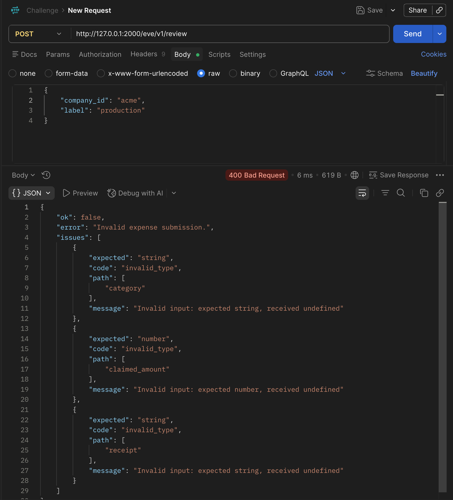

# Findings

## 1. Evals broken — custom channel overwrote default Eve

**Found:** `agent/channels/eve.ts` replaced Eve’s default HTTP channel. Evals call `POST /eve/v1/session`; that route was gone → 404 before any model run.

**Confirmed:** `just evals` → `Cannot find any route matching [POST] .../eve/v1/session`.

**Fixed:** Moved the one-shot API to `agent/channels/review.ts` (`POST /eve/v1/review`). Restored `agent/channels/eve.ts` with `eveChannel()` so session routes work again.

**Why:** Evals need the default Eve channel; the review endpoint should be a separate channel, not an override of `eve`.

## 2. Incomplete review bodies still called the model

**Found:** `POST /eve/v1/review` accepted any non-empty JSON (e.g. only `company_id` + `label`) and ran a full model review.

**Confirmed:** Curl with incomplete body → `200` + agent `reject` (paid tokens).

**Fixed:** `ExpenseSubmissionSchema` (Zod) validates required fields before `send()`. Invalid → `400` + `issues`. Vitest covers schema + HTTP 400 via Supertest.

**Why:** Reject bad input at the edge; don’t spend model calls on incomplete submissions.

## 3. Evals always reviewed the same silent fixture

**Found:** `resolveExpenseSubmission` fell back to `POC_REQUEST_FILE` / `fixtures/request.json`, so every eval hit the same submission.

**Confirmed:** `approve-valid` + `policy-citation` both ignored other fixtures; concurrency made env overrides unsafe.

**Fixed:** Removed the fallback. Dataset `evals/data/cases.yaml` fans out one eval per fixture; each case loads its JSON and passes `clientContext.expense_submission`.

**Why:** Explicit per-case fixtures; no silent cross-case contamination.

## 4. Policy memo leaks across companies

**Found:** `activePolicy` in `policy-store.ts` is process-global. First `search_policy` wins; later companies get the wrong policy. Unknown ids also fell back to Acme (`?? POLICIES.acme`).

**Confirmed:** Vitest isolation test failed (`globex` → Acme). Eval `tenant-isolation` failed expecting Globex `flag_for_review`.

**Fixed:** Removed the memo and Acme fallback. `getCompanyPolicy` looks up by id and throws on unknown. Vitest + `tenant-isolation` eval pass.

**Why:** Multi-tenant isolation; never apply another company’s rules by accident.

## 5. validate_expense ignored line_items totals

**Found:** The tool only checked that core fields were present; `claimed_amount` was never compared to `line_items` (e.g. illegible fixture: claim 1280 vs line 45 → still `valid: true`).

**Confirmed:** Vitest `tests/validate-expense.test.ts` failed until the sum check existed.

**Fixed:** Rewrote validation with Zod; `claimed_amount` must equal `sum(line_items)` (0 when items are missing/empty). Tool `inputSchema` accepts optional `line_items`.

**Why:** Catch total mismatches in the tool, not only in the model’s judgment.

## 6. No lint/format toolchain

**Found:** The repo had no linter or formatter. Style and basic JS/TS hygiene drifted file to file (`agent/`, `evals/`, `tests/`).

**Confirmed:** No ESLint/Biome/Prettier config; only TypeScript + Vitest.

**Fixed:** Added **Ultracite + Biome** (`biome.jsonc` extends Ultracite core + vitest). Scripts `bun run lint` / `bun run format` and `just lint` / `just format`. Autofix + residual cleanups so `agent/`, `evals/`, and `tests/` pass check. Ignores `.output`, `.eve`, `node_modules`, `.workflow-data`. No husky in this change.

**Why:** Consistent style and a cheap quality gate separate from evals/dev, without rewriting challenge logic for lint’s sake.

## 7. Flaky cross-company decision when policy facts are inferred

**Found:** `decision/0003` (Initech meal, per-attendee limit) flip-flopped between `approve` and `flag_for_review`. The rubric said “ambiguous → flag” but never defined that policy facts (attendees, nights, units, duration) must be **explicit** on the receipt — so the model sometimes inferred headcount from line labels to fit under the limit.

**Confirmed:** Same fixture: one run approved (inferred 2 attendees × $25), another flagged; `matches` failed depending on the draw. Earlier “passes” with `approve` also sometimes cited the wrong company’s meal cap.

**Fixed:** Added a generic no-inference rule in `build-instructions.ts` `rubric()` (flag when the limit depends on a fact not stated on the receipt/submission; never approve on an inference that makes the claim fit). Aligned `evals/data/cases.yaml` cross-company expect/description to `flag_for_review`. No fixture-specific examples in the prompt.

**Why:** Stable decisions under per-unit policy limits; evals shouldn’t reward overfitting to one receipt line.

