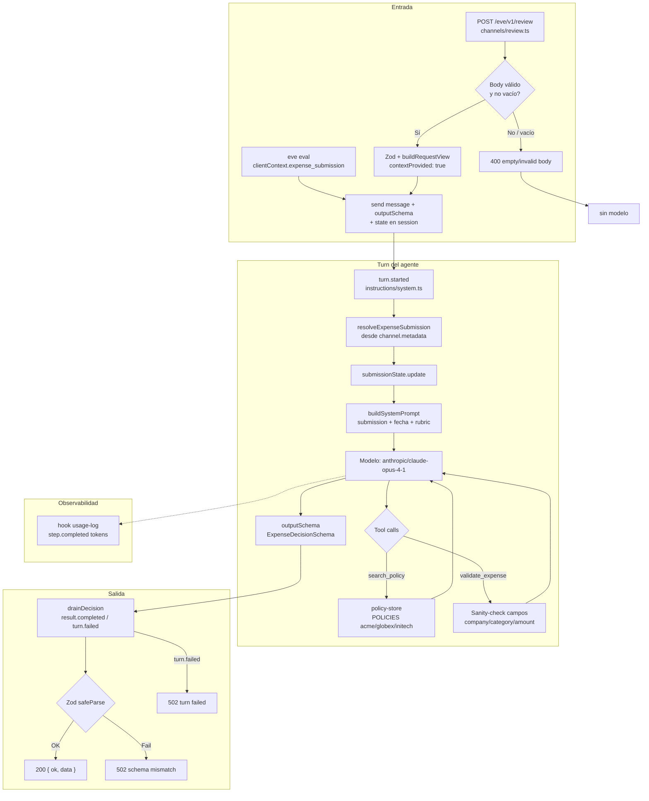
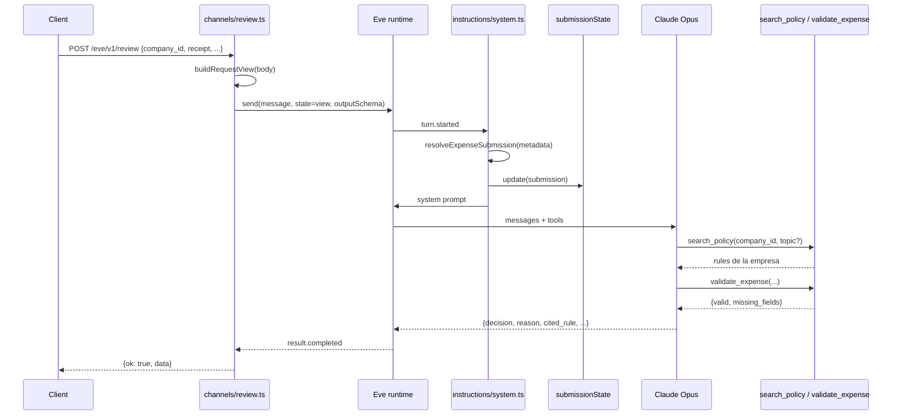

# Expense Guard — Notes

Scan del proyecto: agente TypeScript sobre [Eve](https://github.com/vercel/eve) que revisa un gasto por empresa (`company_id` + recibo OCR + monto + categoría) contra la política de esa empresa y emite `approve` | `flag_for_review` | `reject`.

Stack: Bun, Eve 0.11, Zod 4, AI Gateway → Anthropic.

---

## Estructura

```
expense-guard-challenge/
├── agent/
│   ├── agent.ts              # defineAgent + modelo + outputSchema
│   ├── sandbox.ts            # justbash (workaround macOS)
│   ├── channels/eve.ts       # default session API (/eve/v1/session*)
│   ├── channels/review.ts    # POST /eve/v1/review (one-shot)
│   ├── instructions/system.ts
│   ├── hooks/usage-log.ts
│   ├── lib/                  # schema, policies, context, prompt
│   └── tools/                # search_policy + validate_expense (+ disables)
├── fixtures/                 # request, valid, ambiguous, cross-company, illegible
├── evals/                    # 2 evals happy-path
├── README.md, package.json, .env.example
```

---

## Flujo end-to-end

1. `POST /eve/v1/review` con JSON del gasto (o fixture si el body está vacío).
2. Channel: `buildRequestView` → `send()` con `state` + `outputSchema`.
3. En `turn.started`: resuelve submission → `submissionState` → system prompt.
4. Modelo (Opus) llama tools → emite decisión estructurada.
5. Channel drena el stream → valida con Zod → `{ ok: true, data }`.

---

## Diagrama — flujo general



---

## Diagrama — secuencia (contexto por request)



---

## Piezas clave

| Pieza | Rol |
|--------|-----|
| `agent.ts` | Modelo fijo Opus + `ExpenseDecisionSchema` |
| `channels/eve.ts` | Session API default (`/eve/v1/session*`) para evals/TUI/SDK |
| `channels/review.ts` | One-shot review: state→metadata, drain stream, validación final |
| `request-context.ts` | Fixture vs body; `submissionState` para tools |
| `build-instructions.ts` | Prompt: submission primero, luego rol/pasos/rúbrica |
| `policies.ts` | 3 tenants: acme, globex, initech |
| `policy-store.ts` | Lookup + filtro por topic; memo `activePolicy` |
| Tools deshabilitados | bash, grep, glob, read/write, web_*, todo, ask_question |

**Decision schema:** `decision`, `reason`, `cited_rule`, `category`, `claimed_amount`.

**Políticas (ejemplos):** Acme meals ≤$50/persona; alcohol → reject; Globex software siempre flag; Initech >$100 → flag.

**Fixtures:** `valid`/`request` (Acme meals $96 → approve); `ambiguous` (SaaS $450 → flag); `cross-company` (Initech); `illegible` (recibo ilegible → flag).

**Evals:** dataset `evals/data/cases.yaml` → decision + citation fan-out (one case per fixture).

---

## Señales de problemas (el challenge)

1. **Costo** — Opus 4.1 para un review rutinario; prompt con fecha/submission al inicio (malo para cache).
2. **Aislamiento multi-tenant** — `activePolicy` global en `policy-store.ts` (una vez cargado, puede contaminar otro `company_id`); fallback silencioso a Acme; `search_policy` acepta `company_id` del modelo en lugar de forzar `submissionState`.
3. **`validate_expense` débil** — no usa el state autoritativo; no suma `line_items` vs `claimed_amount`; no detecta recibo ilegible.
4. **Calidad de código** — concatenaciones raras, código comentado, `_status` opaco.
5. **Cobertura de evals** — solo happy path; no cubren cross-company, ambiguous ni illegible.

---

## Cómo correrlo

```bash
bun install && cp .env.example .env   # AI_GATEWAY_API_KEY
bunx eve build && bunx eve dev        # POST /eve/v1/review
bunx eve eval                         # dataset: evals/data/cases.yaml
just review fixtures/valid.json
just lint                             # Ultracite / Biome (bun run lint)
just format                           # autofix + format (bun run format)
```

## Entregables del challenge

PR/diff + `FINDINGS.md` + export de la sesión del coding assistant. ~3h + 1h live.
